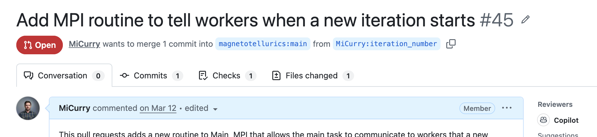

Contributing
=========================

Users are welcome to contribute to ModEM and we welcome contributions! 

We highly recommend opening a GitHub Issue first so that new contributions can be
discussed with ModEM authors, especially for large pull requests.

Contributions can be made via a `GitHub pull request <_github_pr>`_ at the ModEM
repository: https://github.com/magnetotellurics/ModEM/compare.

.. _github_pr: https://docs.github.com/en/pull-requests/collaborating-with-pull-requests/proposing-changes-to-your-work-with-pull-requests/about-pull-requests

Steps To Open a Pull Request (PR)
----------------------------------

See: `Contributing to a project`_.

.. _Contributing to a project : https://docs.github.com/en/get-started/exploring-projects-on-github/contributing-to-a-project

Tips & Testing
---------------

* Please keep pull requests to reasonable sizes (consider breaking up large PR's
  into small ones)
* If you are able, please test your changes using both the GNU gfortran
  compiler and Intel ifort repository (but Gfortran at the minimum if you don't
  have access to the Intel compiler).
* Contribute any relevant documentation to this Documentation (See
  :ref:`building-the-docs`)
* Run the unit tests in the ``unit_testing`` directory (Currently not added)

.. _building-the-docs:

Building this Documentation
----------------------------

This `Sphinx <_sphinx_page>`_ documentation can easily be built if you have Sphinx installed. If you
have Python and Pip installed, you can install Sphinx by:

.. code-block:: bash

    $ pip install -U sphinx

For more information on installing Sphinx see: https://www.sphinx-doc.org/en/master/usage/installation.html.

After making changes to the documentation, you can build locally for testing by doing the following:

.. code-block:: bash

    $ cd ModEM/docs
    $ make html

The HTML files will be built in ``ModEM/docs/build``. You can open these locally
and view them and ensure they look correct. You do not need to (and will not be
able to) commit the built HTML files.

If you change the documentation, please ensure that it builds without errors.

.. _sphinx_page: https://www.sphinx-doc.org/en/master/

Git Tips
---------

New to Git? Here are some of Miles' tips for using Git.

Recommended Workflow
~~~~~~~~~~~~~~~~~~~~~

I keep my local main up-to-date with upstream ``magnetotellurics/ModEM`` and I
don’t commit or merge anything to it ever. That way when I create new branches
for PR’s they are 'clean'. 

Whenever I start working on a new feature, I do:

.. code-block:: bash

   $ git checkout main
   $ git fetch origin
   $ git reset --hard origin/main # Make my local main equal to origin/main
   $ git checkout -b my_new_feature

This will make your local branch ``my_new_feature`` equal to the latest changes
on main, ensuring you start work from the latest changes.

Reviewing Pull Request (PR) 
~~~~~~~~~~~~~~~~~~~~~~~~~~~~

Lets say you are working on a feature in your branch ``my_feature`` and someone
adds you as a reviewer on a PR. It's probably a good idea to checkout those
changes locally and test them. How can you do this while you are working
locally? You have a few options:

Stash Your Changes
^^^^^^^^^^^^^^^^^^

Stashing is very simple and allows us to store our changes in the 'stash' where
we can retrieve them later.

First, stash your changes

.. code-block:: bash

   $ # You can supply messages to a stash, which makes it easy to find later
   $ git stash -m "Working on such and such"

I like to stash my changes if I am in the middle of a feature. Or, if I have
changes I simply want to 'get-rid-of' before checking out another branch.

.. note::

   Stashing is very powerful! See Stashing Tips and Tricks down below.

Commit Your Changes
^^^^^^^^^^^^^^^^^^^^

You can also commit your changes onto your branch before moving away if you
would like:

.. code-block:: bash

   $ git add file1.f90 file2.f90
   $ git commit -m "Did such and such work on file1.f90..."

Fetch and Checkout Their Code
^^^^^^^^^^^^^^^^^^^^^^^^^^^^^^

Now that we have 'saved' our changes, we can now go and get the changes
with the pull request we would like to review.

First, we will need to determine what remote and what branch the PR comes from.

The above image shows the view of a PR that is open on GitHub. Importantly is
the smaller line that says:

| ‘MiCurry wants to merge 1 commit into 'magnetotellurics:main' from 
| 'MiCurry:iteration_number'

Meaning, that MiCurry wants to merge his changes in
``MiCurry:iteration_number`` into ``magnetotellurics:branch``.

Here, MiCurry means the 'MiCurry' users' fork, and ``iteration_number`` is the
branch name *on* MiCurry's fork.

Similarly to cloning, you will need to go to that user's fork and select their
git remote link (Normally in the form of: https://github.com/MiCurry/ModEM.git
or git@github.com:MiCurry/ModEM.git).

Add this link to your git remotes locally:

.. code-block:: bash

   $ git remote add curry https://github.com/MiCurry/ModEM.git

Now, fetch their repo, and checkout the branch associated with their PR:

.. code-block:: bash
   
    $ git fetch curry
    $ git checkout iteration_number

Your local version of ModEM is now equal to what is on `MiCurry:iteration_number
and ready for you to test!`

Getting your changes back
^^^^^^^^^^^^^^^^^^^^^^^^^^^

Now that you have reviewed their PR, you can easily get your changes back by
checkout out the branch you were working on above.

.. code-block:: bash

   $ git checkout my_feature_branch
   $ # If you stashed, just apply your changes:
   $ git stash apply

But wait, they updated their PR!
^^^^^^^^^^^^^^^^^^^^^^^^^^^^^^^^^

Easy! We already have their branch checkout out locally. So we will need to
either: 1. Switch to that branch and update it or 2. Delete the branch locally
and check it out again like we did before:

.. code-block:: bash

   $ # Download the changes from the remote
   $ git checkout iteration_number
   $ # Fetch and make the local branch equal to the remote
   $ git pull --ff-only curry iteration_number 

Your local copy of their branch is now good to retest!

.. note::

   ``git pull`` performs too operations, a ``git fetch`` and a ``git merge``.
   Normally, this would result in a merge commit, but because we want our local
   branch to look exactly like whats in the remote, we do ``-ff-only`` (fast
   foward only).

Now you can also just repeat the process we did intially by first deleting your
local copy of that branch:

.. code-block:: bash

    $ # Delete the branch locally:
    $ git branch -d iteration_number
    $ git fetch curry
    $ git checkout iteration_number

.. note::

   ``git branch -d`` *only* deletes branches locally. If you are afraid of
   losing data, you can always back up a branch before doing something with it.

An easier method?
^^^^^^^^^^^^^^^^^^

If you want an entirely easier method for testing out someone's branches you
can simply just clone their fork of the repository in a new directory:

.. code-block:: bash

   $ cd ~/
   $ git clone https://github.com/MiCurry/ModEM.git modem-curry
   $ cd modem-curry
   $ git checkout iteration_number

Update Your Branch With New Changes
~~~~~~~~~~~~~~~~~~~~~~~~~~~~~~~~~~~~

Occasionally you will want to update your local branch with changes from
origin/main (potentially this could be other remote branches well, but for this
we will stick with origin/main). 

The easiest way - git pull
^^^^^^^^^^^^^^^^^^^^^^^^^^^

``git pull`` is very easy and is probably the method I recommend most for new
users. 

.. code-block:: bash

   $ git checkout my_feature
   $ git branch my_feature_bu # Backup your branch if you would like
   $ # The bellow command with merge our local branch with origin/main
   $ # Note: There might be merge conflicts below:
   $ git pull origin main

Here, we git pull fetches the changes from the remote (named origin) and then
merges the branch (named main) into our local branch. We may need to handle
merge conflicts when we run ``git pull``.

This creates a *merge* commit that merges our branch with the remote/origin.
The merge commit acts as a way to reconcile two diverging branches. The merge
commit, in a way, holds what we choose to keep during a merge conflict.

The More Complicated but cleaner way - git rebase
^^^^^^^^^^^^^^^^^^^^^^^^^^^^^^^^^^^^^^^^^^^^^^^^^^

.. warning::

   Rebasing is an advance git mechanic. I recommend using it once you are very
   familar with merging, and dealing with merge conflicts. 

While ``git pull`` is easy, it leaves behind these merge commits in your local
branch. When you make a PR, these merge commits will be present on your
branch.

One method for getting rid of these unnecessary merge commits in your local
branch is to use 'rebaseing'.

.. code-block:: bash

   $ git checkout my_feature
   $ git branch my_feature_bu
   $ git fetch origin
   $ # Now, we will rebase our changes onto origin main
   $ # Placing our changes on top of main:
   $ # The rebase may have multiple merge conflicts you will have to perform!
   $ git rebase origin/main

You might need to handle multiple merge requests, and sometimes in the same
file multiple times. Simply follow the instructions for the rebase (Fix up
merge conflicts, git add <file-name>, git rebase --continue) until it's happy.

The rebase will take all of our new changes made to our local branch, and place
them directly on top of origin/main. This is essentially like making a new
branch off of main and committing on top of that! No merge commit will be made!

This keeps your local branch history very 'linear' and no local merge commits
will appear in your git history.

However, this changes the 'history' of your branch. If you have pushed this
branch to your remote repository (like GitHub ``git push my_fork my_feature``),
Git will complain that it has a different history.

This is nice, because Git is preventing us from pushing unrelated branches over
each other. However, in this case we want to store our updated/rebased branch
in our remote, so we can force it:

.. code-block:: bash

   $ git branch my_feature_bu_rebased # Always a good idea
   $ git push --force my_fork my_feature

This will update our remote branch to now be equal to your rebased local
branch!

Is Updating Necessary?
^^^^^^^^^^^^^^^^^^^^^^

Imaging you are working on the SP2 forward solver. Consider two scenarios. 

1. origin/main has been updated with some critical changes to the SP2 forward
   solver
2. origin/main has been updated with some documentation changes.

In the first case, it is definitely necessary to update your local branch with
origin/main because those changes will most likely effect your work *and* they
might have merge conflicts with your changes.

In the second case, you really *do not* need to update your local branch.
Although your branch has divereged from origin/main the changes are unrelated
and you can avoid the headache of updating. When you merge your PR, the merge
will automatically reconcile your changes with the docs for us!

Git Stash Tips and Tricks
~~~~~~~~~~~~~~~~~~~~~~~~~~

Git stashing is more powerful than you think! These commands are some commands
I use extremely often and they make using ``git stash`` even more useful!

I am sure you already know about git stash, and git stash apply:

.. code-block:: bash

   $ git stash -m 'Optional message you can add'
   $ # Get the changes out again:
   $ git stash apply

This works pretty simply and pretty well, but git stash apply has a bit of a
flaw in that it always applies the *last* thing that was git stashed! What if
we have stashed multiple times?

.. code-block:: bash

   $ git stash -m "My first stash"
   $ # make some additional changes
   $ git stash -m "Stashing these changes too"
   
Now, if you ``git stash apply``, git will apply the changes associated with the
'Stashing these changes too' stash. But what if you want the ones that were
with the 'My first stash' stash?

First, we can use `git stash list` to see all the stashes we have ever made for
our local clone:

.. code-block:: bash

   $ git stash list
   stash@{0}: On my_feature: 'Stashing these changes too'
   stash@{1}: On my_feature: 'My first stash'
   stash@{2}: WIP on io-choice-namelist: 8d29f3fb saving HDF5 work
   stash@{3}: WIP on hdf5-updates: 8d29f3fb saving HDF5 work

(The last two stashes listed are what stashes look like when you don't give
stash a message).

Here, you can see a list of the stashs I have made on my local repository. As
you can see, the last stash I made is at the top ('Stashing these changes
too'). When you run ``git stash apply``, it will apply the stash that is at the
top of the stash list (stash@{0}.).:w

However, if you wanted a different stash, you can specify that stash exactly
during your apply:

.. code-block:: bash

   $ # Sometimes you need to put quotes around the stash name
   $ # as your shell can complain about these characters:
   $ git stash apply "stash@{1}"

What if you have a lot of stashes and you aren't sure what is contained in
each?

.. code-block:: bash

   $ # Show the files associated with a stash:
   $ git stash show "stash@{2}"
   $ # Show the actually differences in the files:
   $ git stash show "stash@{2}" -p

